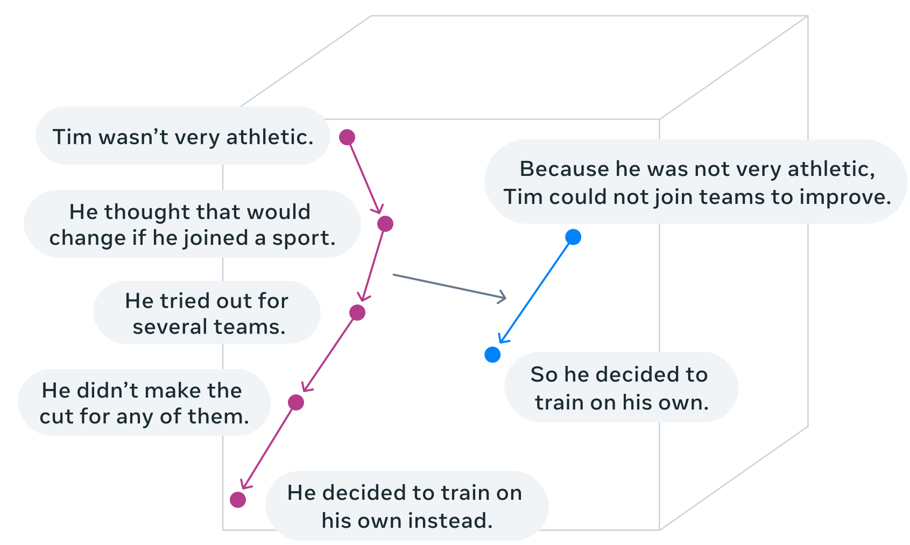
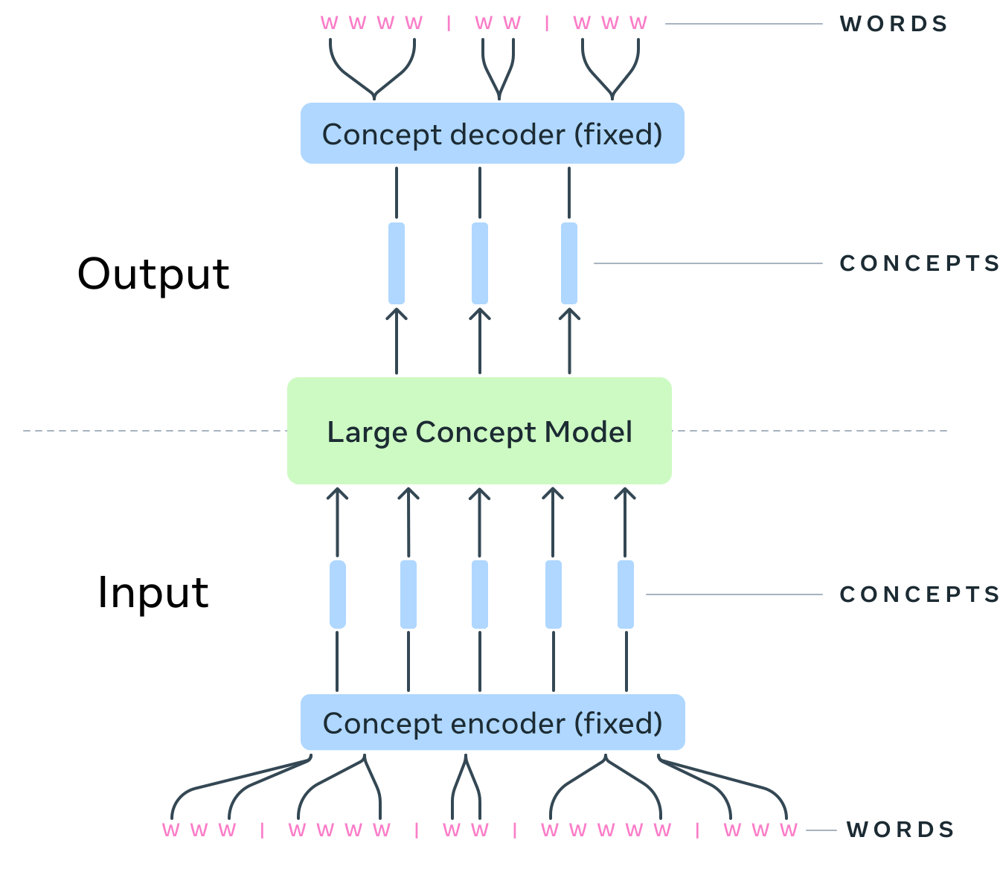

# Large Concept Models
## Language Modeling in a Sentence Representation Space

[[Blog]](https://ai.meta.com/blog/meta-fair-updates-agents-robustness-safety-architecture/) [[Paper]](https://ai.meta.com/research/publications/large-concept-models-language-modeling-in-a-sentence-representation-space/)

This repository provides the official implementations and experiments for [Large Concept Models](https://ai.meta.com/research/publications/large-concept-models-language-modeling-in-a-sentence-representation-space/) (**LCM**).

<p align="center">

</p>


The LCM operates on an explicit higher-level semantic representation,
which we name a "concept". Concepts are language- and modality-agnostic and represent a higher
level idea. In this work, a concept corresponds to a sentence, and we use the [SONAR](https://github.com/facebookresearch/SONAR)
embedding space, which supports up to 200 languages in text and 57 languages in speech. See the list of supported languages [here](https://github.com/facebookresearch/SONAR?tab=readme-ov-file#supported-languages-and-download-links).


## Approach

<p align="center">

</p>


The LCM is a sequence-to-sequence model in the concepts space trained to perform auto-regressive sentence prediction.
We explore multiple approaches:
- MSE regression (`base_lcm` in this code).
- Variants of diffusion-based generation (we include `two_tower_diffusion_lcm` in this release).
- Models operating in a quantized SONAR space (coming soon).

These explorations are performed using 1.6B parameter models and training data in the order of 1.3T tokens. We include in this repository recipes to reproduce the training and finetuning of 1.6B MSE LCM and Two-tower diffusion LCM. See instructions [below](#usage).

## Installing

### Using UV

The LCM repository relies on fairseq2. If you have `uv` installed on your system, you can install a virtual environment with all the necessary packages by running the following commands:
```bash
uv sync --extra cpu --extra eval --extra data
```

You can also use `uv run` to run the demo commands with the correct environment.

Note that we only provide requirements for `cpu` dependencies, if you want to use GPU support, you will have to choose the variants of torch and fairseq2 that work for your system.
For example for torch 2.5.1 with cuda 1.21, You would do something like:
```
uv pip install torch==2.5.1 --extra-index-url https://download.pytorch.org/whl/cu121 --upgrade
uv pip install fairseq2==v0.3.0rc1 --pre --extra-index-url  https://fair.pkg.atmeta.com/fairseq2/whl/rc/pt2.5.1/cu121 --upgrade
```

Check [fairseq2 variants](https://github.com/facebookresearch/fairseq2?tab=readme-ov-file#variants) for possible variants. Note that LCM currently relies on the release candidate for fairseq2 0.3.0 rc1.

### Using pip

To install with pip, the commands are very similar, but you will have to manage your own environment and make sure to install fairseq2 manually first. For instance, for a `cpu` install.

```bash
pip install --upgrade pip
pip install fairseq2==v0.3.0rc1 --pre --extra-index-url  https://fair.pkg.atmeta.com/fairseq2/whl/rc/pt2.5.1/cpu
pip install -e ".[data,eval]"
```

If [fairseq2](https://github.com/facebookresearch/fairseq2) does not provide a build for your machine, check the readme of that project to build it locally.

## Usage

> [!NOTE]
> If using `uv` prefix all commands with `uv run` to use the environment created by default in `.venv`, e.g.,
> `uv run torchrun --standalone`.
> Alternatively, you can activate the environment once and for all with `source .venv/bin/activate`.

### Preparing data

The LCM can be trained and evaluated using textual data split in sentences and embeded with [SONAR](https://github.com/facebookresearch/SONAR/). We provide a sample processing pipeline that can be used to prepare such training data, you can run it with:

```
 uv run --extra data lcm/datasets/prepare_wikipedia.py /output/dir/for/the/data
 ```

 This pipeline shows how to get a dataset from huggingface and process it with SONAR and [SaT](https://arxiv.org/abs/2406.16678). Check out the file for more details on processing your own data. While the script provides an example pulling data from huggingface, we also provide [APIs](https://github.com/facebookresearch/stopes/tree/main/stopes/utils/sharding) to process jsonl, parquet and CSV.

### Datacards

The trainer described below relies on datacards configuring the datasets. These datacards are yaml files with pointers to the dataset files (locally or on s3) and information on its schema. We provide some sample datacards in [`lcm/datacards/datacards.yaml`](https://github.com/facebookresearch/large_concept_model/blob/main/lcm/datacards/datacards.yaml). Once you have processed some data, you can update the datacards with your paths.

#### Fitting a normalizer
To fit a new embedding space normalizer on a given weighted mixture of datasets
one can use the following command :
```bash
python scripts/fit_embedding_normalizer.py --ds dataset1:4 dataset2:1 dataset3:10 --save_path "path/to/new/normalizer.pt" --max_nb_samples 1000000
```
Here, `dataset1`, `dataset2`, `dataset3` are the names of datasets declared in the datacards as shown above
and `(4, 1, 10)` their respective relative weights.
The resulting normalizer can be next declared as a model as shown in `lcm/cards/sonar_normalizer.yaml`
and referenced in all model training configs.


### Pre-training models

#### Base MSE LCM

To train an MSE LCM, we will use one of the following commands:

**Option 1.** Training with SLURM using [submitit](https://github.com/facebookincubator/submitit) via [stopes](https://github.com/facebookresearch/stopes/tree/main)'s launcher:
```sh
python -m lcm.train \
    +pretrain=mse \
    ++trainer.output_dir="checkpoints/mse_lcm" \
    ++trainer.experiment_name=training_mse_lcm \
```
With this command, we will submit a slurm job named `training_mse_lcm` with the recipe's requirements, in this case:
```yaml
requirements:
  nodes: 4
  tasks_per_node: 8
  gpus_per_node: 8
  cpus_per_task: 32
  mem_gb: 0
  timeout_min: 10000
```
You can override the job's requirements like the timeout limit and the launcher's slurm partition with:
```sh
python -m lcm.train \
    +pretrain=mse \
    ++trainer.output_dir="checkpoints/mse_lcm" \
    ++trainer.experiment_name=training_mse_lcm \
    ++trainer.requirements.timeout_min=100 \
    ++trainer.requirements.cpus_per_task=8 \
    ++launcher.partition=$partition_name
```

**Option 2.** Training locally with `torchrun` (e.g. using only 2 GPUs) with a smaller batch size (overriding `++trainer.data_loading_config.max_tokens=1000`):
```sh
CUDA_VISIBLE_DEVICES=0,1 torchrun --standalone --nnodes=1 --nproc-per-node=2 \
    -m lcm.train launcher=standalone \
    +pretrain=mse \
    ++trainer.data_loading_config.max_tokens=1000 \
    ++trainer.output_dir="checkpoints/mse_lcm" \
    +trainer.use_submitit=false \
```
> [!IMPORTANT]
> Since we're changing the number of GPUs required by the recipe, this will not reproduce the experimental setup of the paper.

The checkpoints directory `checkpoints/mse_lcm` will be structured as:
```
.
├── checkpoints
│   ├── step_2000
│   ├── ...
│   └── step_250000
├── config_logs
├── executor_logs
├── model_card.yaml
├── tb   # tensorboard logs
└── wandb  # W&B logs
```
Note that W&B logging is skipped unless `wandb` is available.
You can install `wandb` with `uv pip install wandb`.
W&B arguments can be changed by overriding Hydra config values in the recipe:

```sh
++trainer.wandb_project=$project_name
++trainer.wandb_run_name=$run_name
```

#### Two-tower diffusion LCM

Similar to the base MSE LCM we can submit a training job following the recipe in [./recipes/train/pretrain/two_tower.yaml](./recipes/train/pretrain/two_tower.yaml) via:

```sh
python -m lcm.train \
    +pretrain=two_tower \
    ++trainer.output_dir="checkpoints/two_tower_lcm" \
    ++trainer.experiment_name=training_two_tower_lcm \
```

> [!TIP]
> To understand the different ingredients of training recipes, check [this README](./recipes/train/README.md).


### Finetuning models
To finetune the previously pre-trained two-tower diffusion LCM on supervised data,  follow these steps:

**Step 1.** Register the pre-trained checkpoint as a fairseq2 asset.

You can finetune the final checkpoint with the card `checkpoints/two_tower_lcm/model_card.yaml` or any checkpoint after a specific number of training steps, e.g., `checkpoints/two_tower_lcm/checkpoints/step_2000/model_card.yaml`.
To register the selected checkpoint, copy the automatically created yaml file to `./lcm/cards/mycards.yaml` and rename the model to replace the default `on_the_fly_lcm`.
`./lcm/cards/mycards.yaml` will look like:
```yaml
__source__: inproc
 checkpoint: file://path_to/large_concept_model/checkpoints/two_tower_lcm/checkpoints/step_2000/model.pt
 model_arch: two_tower_diffusion_lcm_1_6B
 model_family: two_tower_diffusion_lcm
 name: my_pretrained_two_tower
```
For more on how to manage fairseq2 assets, see [documentation](https://facebookresearch.github.io/fairseq2/nightly/basics/assets.html).

**Step 2.** Launch a finetuning job pointing to the model to finetune, in this instance `my_pretrained_two_tower`:
```sh
CUDA_VISIBLE_DEVICES=0,1 torchrun --standalone --nnodes=1 --nproc-per-node=2 \
    -m lcm.train launcher=standalone \
    +finetune=two_tower \
    ++trainer.output_dir="checkpoints/finetune_two_tower_lcm" \
    ++trainer.data_loading_config.max_tokens=1000 \
    +trainer.use_submitit=false \
    ++trainer.model_config_or_name=my_pretrained_two_tower
```
or

```sh
python -m lcm.train \
    +finetune=two_tower \
    ++trainer.output_dir="checkpoints/finetune_two_tower_lcm" \
    ++trainer.experiment_name=finetune_two_tower_lcm \
    ++trainer.model_config_or_name=my_pretrained_two_tower
```

Similarly, to finetune an MSE LCM, follow the same instructions for registering a pre-trained checkpoint and submit a finetuning job with the appropriate recipe ([./recipes/train/finetune/mse.yaml](./recipes/train/finetune/mse.yaml)) via:
```sh
python -m lcm.train \
    +finetune=mse \
    ++trainer.output_dir="checkpoints/finetune_mse_lcm" \
    ++trainer.experiment_name=finetune_mse_lcm \
    ++trainer.model_config_or_name=my_pretrained_mse_lcm
```
### Evaluating models


> [!NOTE]
> For advanced evaluation (benchmarking different tasks, comparing results with LLMs, etc.) , check [the evaluation documentation](./examples/evaluation/README.md).


**Step 0.** Download NLTK data required for evaluating ROUGE:
```py
python -m nltk.downloader punkt_tab
```

**Step 1.**
Generate and score outputs of a model either by pointing to its `model_card` yaml file or after registering it as a fairseq2 asset (the same way we registerd `my_pretrained_two_tower`):
```sh
model_card=./checkpoints/finetune_two_tower_lcm/checkpoints/step_1000/model_card.yaml
OUTPUT_DIR=evaluation_outputs/two_tower

torchrun --standalone --nnodes=1 --nproc-per-node=1 -m lcm.evaluation  \
  --predictor two_tower_diffusion_lcm  \
  --show_progress true \
  --data_loading.max_samples 100 \
  --model_card ${model_card} \
  --launcher standalone \
  --dataset.source_suffix_text '[MODEL]:' \
  --tasks finetuning_data_lcm.validation \
   --task_args '{"max_gen_len": 10, "eos_config": {"text": "End of text."}}' \
  --data_loading.batch_size 4  --generator_batch_size 4 \
  --dump_dir ${OUTPUT_DIR} \
  --inference_timesteps 40 \
  --initial_noise_scale 0.6 \
  --guidance_scale 3 \
  --guidance_rescale 0.7
```
where in the example we are evaluating 100 samples only (`--data_loading.max_samples 100`) and limiting the model output length to 10 sentences (`--task_args '{"max_gen_len": 10}'`).

Outputs dumped in `./evaluation_outputs/two_tower` will be structured as:
```
.
├── metadata.jsonl
├── metrics.eval.jsonl
├── raw_results
├── results
└── tb
```
where `metrics.eval.jsonl` contains corpus-level scores.


To evaluate an MSE LCM, we use the associated predictor (`base_lcm`) and evaluate with:

```sh
model_card=./checkpoints/finetune_mse_lcm/checkpoints/step_1000/model_card.yaml
OUTPUT_DIR=evaluation_outputs/mse_lcm

torchrun --standalone --nnodes=1 --nproc-per-node=1 -m lcm.evaluation  \
  --predictor base_lcm --sample_latent_variable False \
  --show_progress true \
  --data_loading.max_samples 100 \
  --model_card ${model_card} \
  --launcher standalone \
  --dataset.source_suffix_text '[MODEL]:' \
  --tasks finetuning_data_lcm.validation \
   --task_args '{"max_gen_len": 10, "eos_config": {"text": "End of text."}}' \
  --data_loading.batch_size 4  --generator_batch_size 4 \
  --dump_dir ${OUTPUT_DIR} \
```

Note that in this example, we only show how to evaluate the LCM on the same finetuning dataset (validation split). To evaluate in a downstream task, and compare results with the LLM, refer to the [Evaluation documentation](./examples/evaluation/README.md).

## Contributing

See the [CONTRIBUTING](CONTRIBUTING.md) file for how to help out.

## Citation

If you use this codebase, please cite:
```
@article{lcm2024,
  author = {{LCM team}, Lo\"{i}c Barrault, Paul-Ambroise Duquenne, Maha Elbayad, Artyom Kozhevnikov, Belen Alastruey, Pierre Andrews, Mariano Coria, Guillaume Couairon, Marta R. Costa-juss\`{a}, David Dale, Hady Elsahar, Kevin Heffernan, Jo\~{a}o Maria Janeiro, Tuan Tran, Christophe Ropers, Eduardo Sánchez, Robin San Roman, Alexandre Mourachko, Safiyyah Saleem, Holger Schwenk},
  title = {{Large Concept Models}: Language Modeling in a Sentence Representation Space},
  publisher = {arXiv},
  year = {2024},
}
```

## License

This code is released under the MIT license (see [LICENSE](./LICENSE)).
